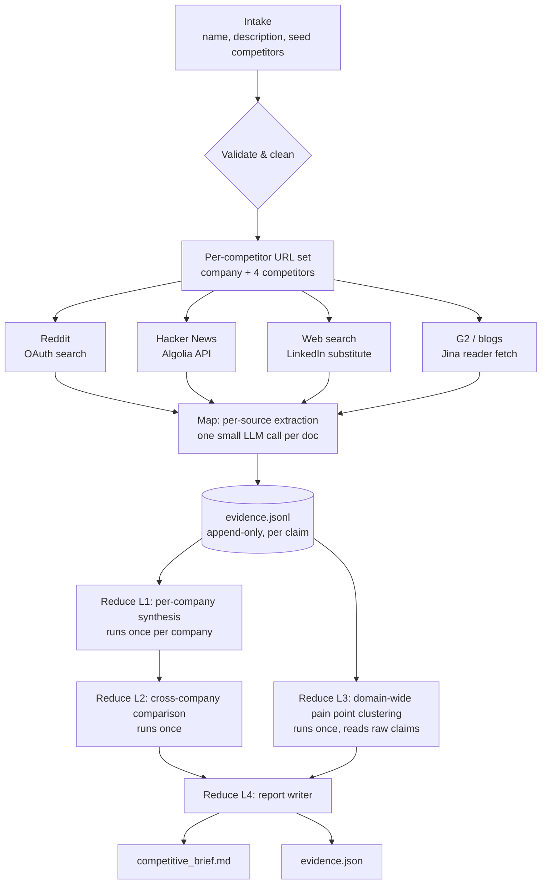
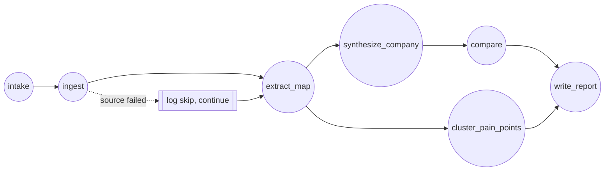

# Competitive Intelligence & Market Gap Agent — Design Doc

Stack: **LangGraph** (orchestration) + **OpenAI mini/nano models** (extraction + reasoning) + flat **JSONL** evidence store (no vector DB — this is a traceability problem, not a retrieval-at-scale problem).

> Model note: as of mid-2026 the cheapest usable OpenAI tiers are **GPT-5.4 Mini** (structured extraction, per-competitor reasoning) and **GPT-5.4 Nano** (simplest map-stage extraction, cheapest routing). Check OpenAI's pricing page before you build — this tier refreshes every few months and names/prices shift.

---

## 1. High-level pipeline



---

## 2. Stage-by-stage detail

### A. Intake
- Input: company name, one-paragraph description (product, domain, target user), seed list of 3-5 competitors.
- Validation: dedupe competitors, flag anything not a distinct real/realistic entity, resolve each to a canonical domain/URL where possible.
- Output: a `Competitor` object per entity (including the target company itself, treated as competitor #0).

### B. Ingestion — 4 sources, run per competitor
Each source client is independent and **must fail soft**: on error/empty/blocked, log a `SourceSkip` record and move on — never crash, never fabricate.

| Source | Access | Notes |
|---|---|---|
| Reddit | OAuth script app (PRAW or raw `requests`) | Unauthenticated `.json` is deprecated as of May 2026 — register a free script app. |
| Hacker News | Algolia Search API, no auth | Fast, free, great for tech/SaaS companies. |
| Web search | Any search API you have | Used to surface LinkedIn company pages, news, general competitor discovery — not scraped directly. |
| G2 / blogs / changelogs | Jina Reader (`r.jina.ai/<url>`) | Free, no key for basic usage; turns any page into clean markdown for the extractor. |

### C. Map stage — per-source extraction
One LLM call **per fetched document** (one Reddit thread, one HN thread, one fetched page). Small context, fully parallelizable, cheap model (Nano/Mini). Never batch multiple documents into one call — that's what causes hallucinated cross-contamination between sources.

Prompt shape: *"Here is one document about \[competitor\]. Extract claims about pricing/features/UX/support/positioning. Every claim must include the exact verbatim quote it came from."*

Output → appended to `evidence.jsonl` (one JSON object per line, one file for the whole run — not one file per competitor, so the reduce stages can query across competitors without joining files).

### D. Evidence store schema

```json
{
  "evidence_id": "ev_0001",
  "competitor": "Acme CRM",
  "source": "reddit",
  "url": "https://reddit.com/r/saas/comments/...",
  "platform": "reddit",
  "date": "2026-03-12",
  "claims": [
    {
      "claim_id": "cl_0001",
      "dimension": "pricing",
      "text": "users say pricing jumps sharply above 10 seats",
      "quote": "the jump from 5 to 10 seats basically doubles your bill",
      "sentiment": "negative"
    }
  ]
}
```
- `quote` must be a verbatim substring of the source text — validate this in code, not just in the prompt.
- Dedup at write time: hash normalized claim text; if a near-duplicate already exists for the same competitor+dimension, link it as a second source rather than writing a new claim.

### E. Reduce Layer 1 — per-company synthesis (runs once per competitor, ~5x)
- Input: all claims in `evidence.jsonl` tagged to one company.
- Job: group by dimension, keep conflicting sentiments side by side (never resolve them into one answer), dedupe.
- Output: `CompanyProfile` — pointers back to claim IDs, not restated prose without grounding.

### F. Reduce Layer 2 — cross-company comparison (runs once)
- Input: all `CompanyProfile` objects (small — already-compressed, not raw claims).
- Job: build the dimension-by-dimension comparison table; explicitly list gaps both directions (competitor-has-target-lacks, and vice versa).

### G. Reduce Layer 3 — domain-wide pain point clustering (runs once)
- Input: **raw** `evidence.jsonl` claims tagged as complaints/unmet-needs, across *all* companies — bypasses the per-company grouping in Layer 1 on purpose, since a pain point repeated across 3 competitors is the domain signal.
- Job: cluster similar complaints (a single LLM call doing grouping is fine at this corpus size — true embedding clustering is an optional stretch goal, not required).
- Output: `PainPointCluster` objects, each tagged with member claim IDs + which companies/sources they touch.
- Distinguish: company-specific weakness (tied to one company) vs. domain-wide gap (tied to several).

### H. Reduce Layer 4 — report writer (runs once)
- Input: Layer 2's comparison + Layer 3's clusters + Layer 1 profiles for the overview section.
- Job: assemble `competitive_brief.md` — this stage should **not** introduce new claims, only narrate what's already computed.
- Also emits `evidence.json`: every claim/pain point with its quote, source URL, platform, and applicable company/companies.

---

## 3. LangGraph node graph



- `intake`, `ingest`, `extract_map`: can run concurrently per competitor/source (LangGraph `Send` / fan-out).
- Conditional edge on `ingest`: source failure → log-and-continue node, never a hard stop.
- `synthesize_company` fans out per competitor, `compare`/`cluster_pain_points`/`write_report` are single terminal reduces.

---

## 4. Required-behavior checklist (map to code, not just prompts)
- [ ] Quote-substring validator on every claim before it's written to `evidence.jsonl`
- [ ] Source client try/except → `SourceSkip` log, no crash, no fabricated substitute
- [ ] Dedup check at write time (claim-text hash or embedding similarity)
- [ ] Conflicting-sentiment claims stored separately, never merged into one verdict
- [ ] Test 1: unreachable/blocked/empty source → pipeline completes, skip logged
- [ ] Test 2: same claim from 2 sources → deduped/linked, not duplicated
- [ ] Test 3: two conflicting claims about one competitor → both present in output